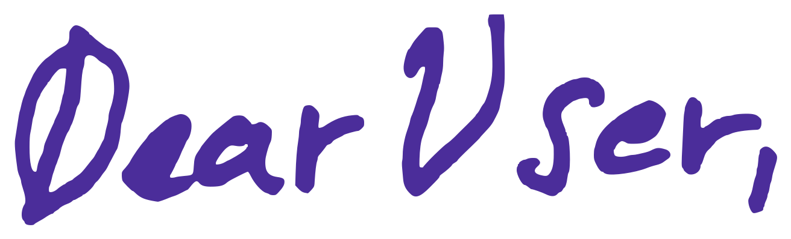
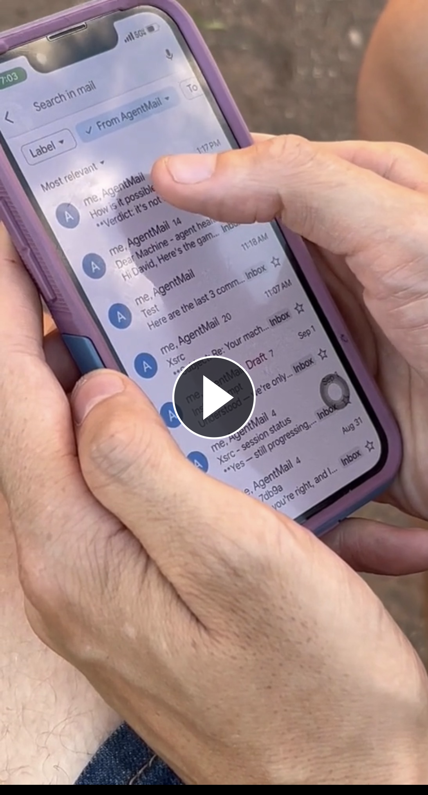
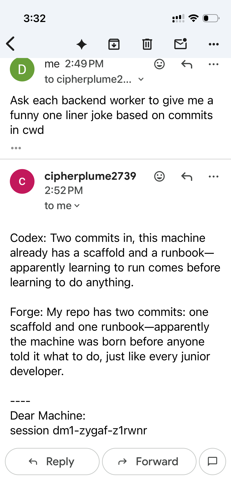
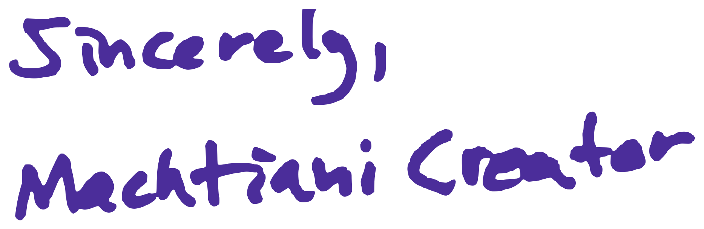

**Email your computer. It will email you back using the agents you already know and use, with attachments and group conversations. Threads and sessions are the same thing, and you can use your favorite agent, or combinations of them, in any email thread.**

**Dear Machine** is the local client that lets you email back and forth with your computer. **Machtiani** is the experimental harness underneath it, using iteration to manage long-running sessions without compaction. Its memory model is simple and effective, leveraging git.

&nbsp;&nbsp;Use your existing email address (Gmail, etc.) to email your computer, with attachments.

&nbsp;&nbsp;Securely add others, including agents, to a group email conversation and with as many simultaneous threads as you want.

&nbsp;&nbsp;Remembers what you're working on with local, non-cloud-based memory.

&nbsp;&nbsp;Use your favorite agents already installed (Claude Code, Codex CLI, OMP, etc.), and with whatever sandboxing you want (ask the concierge to help make an adapter for your sandboxed agent).

&nbsp;&nbsp;Watch the work on your computer by running `machtiani run --attach` on the terminal, if you want.


You only need to remember 2 things. The email address to the computer and the command `dearmachine` to run on the computer's terminal to manage the Dear Machine client and to get help.


## Install - Windows, Linux, macOS and Nix

You must build from source. Download and install is coming soon...

Clone the project, including its pinned submodules. On Windows, use PowerShell.

```bash
git clone --recurse-submodules https://github.com/tursomari/machtiani.git
cd machtiani
```
Follow the BYOC or Concierge installation method. Either will guide you through setup in natural language. And it can manage Dear Machine for you long after.

### Bring Your Own Concierge (BYOC)

For example in `machtiani` directory, on Linux, Nix, macOS, or Windows:

```bash
claude "Read BYOC.md and follow it."
codex "Read BYOC.md and follow it."
omp "Read BYOC.md and follow it."
```

You can ask it to do a Nix install even if you don't have NixOS.

After install if you ever need to do anything, just do something like

```bash
codex "Read BYOC.md. I have some tasks and questions for you."
```

For example to add a new email address, changing models, etc,.

You can also ask it how it works and how to run Dear Machine and Machtiani commands yourself.

If you prefer to use the concierge instead, see below.

### Concierge

In case you don't have an agent already installed or prefer to use the Dear Machine concierge.

#### Nix — Linux and macOS (recommended)

You don't need NixOS. You need Nix 2.24+ with flakes enabled.

```bash
nix run ./dearmachine-concierge -- quick-start --source-root "$PWD"
```

#### Standard — Linux and macOS

You'll need Python 3. On Linux x86-64, you'll also need Docker with Buildx. On macOS, you need Apple's Command Line Tools (`xcode-select --install` if missing); Docker isn't needed.

```bash
installer=$(sh scripts/build-standard.sh --bootstrap) &&
  "$installer" quick-start --method standard --source-root "$PWD"
```

This builds the installer, then runs it if the build succeeds. On Linux, Docker builds the binaries; it isn't needed for normal operation. See [Linux Docker build details](docs/container-build-installation.md).

Dear Machine walks you through models and providers, agent backends, your email inbox, and pairing. It automatically configures the inbox with AgentMail (US-based), OpenMail (EU-native), or Sendmux. Then email your computer its first task:

> Take a look at [your project]. What changed recently, and what are some outstanding issues?

## Using it

After setup, Dear Machine runs in the background; you can close the concierge and its terminal. Run `dearmachine` anytime to configure or manage models, providers, backends, inboxes, and updates.

**At my desk.** I'll email my computer on the side while working with Claude Code on something in a tight loop. Usually I'll have a couple of terminal tabs open watching my email work progress:

```bash
machtiani run --attach --session-id "<session-id-from-email-thread>"
```

**Away from my desk.** Email my computer, mostly via my phone.

**Work emergencies.** Panic email my computer, mostly via my phone.

You can also run Machtiani directly in your project after setup:

```bash
machtiani init
machtiani run --mode code -p "Summarize this project and suggest a useful next step."
```

See the [Machtiani guide](docs/machtiani-guide.md) for more.

## How Machtiani works

Working tightly coupled to an agent in the terminal is different from managing several tasks concurrently, and with others. The shell is foundational for computer work; email brings threads and collaboration to that work.

<p align="center">
  &nbsp;&nbsp;
  <a href="https://vimeo.com/1231158099?share=copy&fl=sv&fe=ci"></a>
  &nbsp;&nbsp;
  <a href="assets/email-replies.png"></a>
</p>

Machtiani's instructor (the iterative planner) repeatedly dispatches a simple but powerful ReAct worker to task your agents. The worker inherits the instructor's accumulated context, but not its system instructions, and runs in an isolated continuation. Only its answer comes back. This hierarchical, asymmetric flow leaves the instructor unburdened by the worker's shell commands, tool calls, and other agents' execution histories.

The instructor, ReAct worker, and backend agents can each use independent models and configurations. Each has targeted instructions; you choose the agents and sandboxing. The default supported adapters don't have sandboxing. You'll need to create an adapter if you need the backend agents to have sandboxing. Any sandoxed agent must run in some equivalent of auto-mode, where Dear Machine will surface permissions when it thinks something is out of scope or you tell it is. Just ask your BYOC agent or concierge by running `dearmachine` in your terminal.

Each kick-off can run for one turn or many depending on the task complexity. Reply in the same thread to continue or change the goal, while other threads carry on independently.

For more on the reasoning behind this, see the [blog post](https://www.machtiani.chat/blogs/the-shell).

## Use with OpenClaw-like agents

Create an email account for your self-hosted agent with AgentMail, OpenMail, Sendmux, or another provider. Then have it email your computers via Dear Machine when it needs work done or needs information from them.

## What's inside

This umbrella repository holds the glue, tests, and scripts. The product lives in three pinned submodules: [Dear Machine](dearmachine), the [Machtiani harness](machtiani-harness), and the [installer](dearmachine-concierge).

The project is mostly Go, with a TypeScript installer, shell, and the TLA+ specifications and Gobra contracts used to check [Dear Machine's guest authorization](https://github.com/tursomari/dearmachine/blob/main/verification/guest/README.md). GitHub's language bar covers only this umbrella repository, about 8% of the project.

<p align="center">
  <a href="assets/code-stats-current.svg"></a>
</p>

## License

MIT. See [LICENSE](LICENSE).

This is the major upgrade we promised, over a year after the initial debut, and the first update since. Thanks for the support that let me focus.


